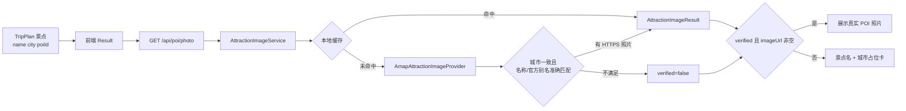

# HelloJourney V3.1 景点图片真实性升级报告

> 完成日期：2026-08-20
> 开发分支：`test/hello-journey-v3-upgrade`
> 基线提交：`7605a9d`
> 核心实现提交：`2277994`、`3138e52`、`add4037`

## 1. 结论与范围

本期已将景点图片从“模型字段、Picsum 或小红书首篇笔记图片均可直接展示”的弱校验链路，改为“服务端按城市和景点身份解析、前端只展示已验证结果”的可信链路。

本期上线范围如下：

- 新增稳定接口 `AttractionImageProvider.resolveImage(attractionName, city, poiId)`。
- 接入高德 POI 2.0 搜索作为首个图片 Provider。
- 仅接受城市一致，且官方名称或官方别名准确匹配的 POI。
- 新增进程内本地缓存，缓存键为规范化后的 `city + attractionName`。
- 删除前端、Mock 和 UniApp 接口中的随机图片逻辑。
- 无 Key、无匹配、无照片或图片加载失败时，统一显示带景点名称和城市的确定性占位卡。

本期不包含地图 Provider 切换、持久化分布式缓存、图片 CDN 转存和管理后台补图。现有 `TripPlan` / `Attraction` 数据结构不做大规模重构。

## 2. 修改原因

旧链路没有把“图片”和“POI 身份”绑定。`image_url`、Picsum 和小红书首篇笔记图片都可能与景点名称无关，因此广州塔、长隆野生动物园等景点会展示随机照片。旅游产品把地点照片作为决策信息，错误图片比缺少图片更具误导性。

本期采用保守策略：只有 Provider 能证明“城市一致 + 名称准确匹配”时，前端才展示照片；系统无法证明图片身份时明确降级，不猜测、不随机补图，也不使用 AI 生成图伪装真实照片。

## 3. 修改文件

### 3.1 后端

| 文件 | 修改内容 |
| --- | --- |
| `backend/src/main/java/com/hellojourney/service/image/AttractionImageProvider.java` | 定义图片 Provider 稳定接口。 |
| `backend/src/main/java/com/hellojourney/service/image/AmapAttractionImageProvider.java` | 调用高德 POI 2.0 搜索，执行城市、名称、照片 URL 和 POI 身份校验。 |
| `backend/src/main/java/com/hellojourney/service/image/AttractionImageService.java` | 编排 Provider，维护 1000 条进程内 LRU 缓存和正负缓存 TTL。 |
| `backend/src/main/java/com/hellojourney/model/vo/AttractionImageResult.java` | 定义 `imageUrl`、`provider`、`matchedName`、`matchedPoiId`、`confidence`、`verified` 返回结构。 |
| `backend/src/main/java/com/hellojourney/controller/PoiController.java` | 将 `/api/poi/photo` 升级为城市必填的新协议，并增加输入边界校验。 |
| `backend/src/main/java/com/hellojourney/config/AppSettings.java` | 增加高德图片搜索配置。 |
| `backend/src/main/resources/application.yml`、`backend/.env.example` | 增加 `AMAP_API_KEY` 和 `AMAP_API_BASE_URL`，默认只访问 HTTPS 官方域名。 |
| `backend/src/test/java/com/hellojourney/service/image/AmapAttractionImageProviderTest.java` | 覆盖广州塔准确匹配、长隆官方别名、相似名称拒绝、城市不符拒绝和不安全 URL 拒绝。 |
| `backend/src/test/java/com/hellojourney/service/image/AttractionImageServiceTest.java` | 覆盖本地缓存和确定性空结果。 |
| `backend/src/test/java/com/hellojourney/controller/PoiControllerTest.java` | 覆盖新接口协议和无效参数。 |

### 3.2 Web 前端与 UniApp

| 文件 | 修改内容 |
| --- | --- |
| `frontend/src/components/AttractionImage/index.tsx`、`index.css` | 新增统一图片组件和深色主题占位卡；远程图片失败后回退占位卡。 |
| `frontend/src/components/AttractionImage/index.test.tsx` | 覆盖无图片与图片加载失败两个降级场景。 |
| `frontend/src/pages/Result/index.tsx` | 按每日城市、景点名称和 `poi_id` 调用解析接口；忽略未经验证的模型 `image_url`。 |
| `frontend/src/components/OverviewAttractionCard/index.tsx` | 移除 Picsum fallback，改用统一图片组件。 |
| `frontend/src/components/TripDayCard/index.tsx` | 移除 Picsum 和模型 `image_url` 直出逻辑。 |
| `frontend/src/services/poiApi.ts`、`otherApi.ts` | 接入新返回协议，并提供稳定的城市/景点缓存键。 |
| `frontend/src/services/poiApi.test.ts` | 覆盖请求参数和缓存键规范化。 |
| `frontend/src/types/api.ts` | 增加 `AttractionImageResult` 类型。 |
| `frontend/src/mocks/handlers.ts`、`mockData.ts` | Mock 改为确定性 `verified=false`，删除随机图片字段。 |
| `uniapp/src/api/poi.ts` | 同步新接口协议，城市改为必填。 |
| `frontend/docs/API.md`、`README.md` | 记录新协议、配置和无图片降级规则。 |
| `HELLOJOURNEY_V3_1_IMAGE_UPGRADE.md` | 记录本次方案、测试和后续建议。 |

用户体验反馈目录 `智途星旅测试反馈/` 保持未跟踪状态，本期没有修改或提交。

## 4. 数据流变化



新链路的关键规则如下：

1. 前端不再信任 Agent 或历史计划中的 `image_url`。
2. 服务端通过高德 `v5/place/text`，以 `keywords=景点名称`、`region=城市`、`city_limit=true` 搜索 POI，并请求 `photos,business` 字段。
3. Provider 规范化城市后要求完全一致；名称只接受官方名称完全一致或官方别名完全一致。
4. Provider 只返回带主机名的 HTTPS 图片 URL。
5. `poiId` 参与候选排序，并把最终高德 POI ID 返回给调用方；本期缓存键按需求保持 `city + attractionName`。
6. 验证成功结果缓存 24 小时；未找到结果缓存 10 分钟；缓存最多保留 1000 条，进程重启后可安全重建。

接口返回示例如下：

```json
{
  "imageUrl": "https://aos-cdn-image.amap.com/example.jpg",
  "provider": "amap",
  "matchedName": "广州塔",
  "matchedPoiId": "B00140TY2A",
  "confidence": 1.0,
  "verified": true
}
```

无 Key 或未匹配时返回固定空结果：

```json
{
  "imageUrl": "",
  "provider": "none",
  "matchedName": "",
  "matchedPoiId": "",
  "confidence": 0.0,
  "verified": false
}
```

## 5. TripStar 对照与实体调整结论

[TripStar](https://github.com/1sdv/TripStar) 的 `Attraction` 同样包含 `name`、`location`、`photos`、`poi_id` 和 `image_url`。HelloJourney 当前 `Attraction` 已具备这些字段，因此本期没有复制第二套旅游实体，也没有重写 `TripPlan`。

最小调整是把图片身份判断从 `Attraction` 实体中抽离到 Provider 端口。后续增加其他权威图片源时，只需新增 `AttractionImageProvider` 实现并在 Spring 组装层注册，结果页和接口协议无需变化。参考：[TripStar Attraction schema](https://github.com/1sdv/TripStar/blob/main/backend/app/models/schemas.py)。

## 6. 测试结果

### 6.1 自动化测试

| 检查项 | 结果 |
| --- | --- |
| `frontend: npm test -- --pool=threads --maxWorkers=1` | 通过，5 个测试文件、10 个测试。 |
| `frontend: npm run lint` | 通过。 |
| `frontend: npm run typecheck` | 通过。 |
| `frontend: npm run build` | 通过，Vite 8.1.5，3983 个模块，约 0.93 秒。 |
| `backend: mvn test` | 通过，148 个测试，0 失败、0 错误、0 跳过。 |

Windows 环境中默认并发 Vitest 运行曾长期无输出，因此完整测试使用单 worker 模式完成；这不是测试失败。Maven 未加入系统 `PATH`，测试使用 IntelliJ IDEA 自带 Maven 和本机 Java 17 执行。

### 6.2 广州浏览器验收

浏览器通过隔离端口连接当前分支的真实前后端，关闭 MSW，并加载一条完成态广州行程。测试环境明确不配置 `AMAP_API_KEY`，符合“没有真实 Key 时使用确定性 placeholder”的验收分支。

验收输入包含以下景点：

- 长隆野生动物园
- 广州塔
- 陈家祠
- 北京路步行街

验收结果如下：

- 四次图片解析均返回 `verified=false`、`provider=none` 和空 `imageUrl`。
- 页面存在全部四个景点名称。
- 页面原生 `` 元素数量为 0，没有加载 Picsum、随机 URL 或模型遗留图片。
- 四张卡分别显示“景点名称 + 广州 + 等待图片补充”。
- 深色主题下占位文字、定位图标和活动卡片状态可读。
- 浏览器控制台只有一条既存的 Ant Design `Spin.tip` 弃用警告，与图片链路无关。

真实照片匹配由 Provider 单元测试覆盖：广州塔官方名称匹配返回 `confidence=1.0`；长隆野生动物园匹配高德官方别名返回 `confidence=0.98`。由于本机没有真实高德 Key，本次浏览器验收不宣称调用了线上高德照片服务。

### 6.3 随机图片清理

仓库搜索已排除 `node_modules`、`target` 和用户反馈目录，Picsum、随机 URL、旧 `photo_url` 消费逻辑和 `getPoiPhoto` 旧接口均已从产品代码移除。文档中保留“不要使用随机图片”的规则说明不属于运行逻辑。

## 7. 配置、上线与回滚

配置高德 Web 服务 Key：

```bash
AMAP_API_KEY=your-amap-web-service-key
AMAP_API_BASE_URL=https://restapi.amap.com
```

推荐上线顺序如下：

1. 在服务端配置 `AMAP_API_KEY`，先部署兼容新协议的后端。
2. 使用广州塔、长隆野生动物园等白名单景点检查 `matchedName`、`matchedPoiId` 和 `verified`。
3. 部署 Web 前端和 UniApp 消费方。
4. 观察 Provider 成功率、未匹配率、响应时间和高德配额，再逐步放量。

本期没有数据库迁移。若高德服务异常，清空或撤销 `AMAP_API_KEY` 即可立即进入占位卡降级。若需要代码级回滚，可按提交逆序回退 `add4037`、`3138e52`、`2277994`；不要合并或重置 `main`。

建议下一阶段增加以下低基数指标：

- `attraction_image_resolve_total{provider,result}`
- `attraction_image_resolve_duration_ms{provider}`
- `attraction_image_cache_total{result=hit|miss}`
- `attraction_image_mismatch_total{reason=name|city|photo|provider}`

高德 POI 2.0 搜索参数和照片返回结构以[高德开放平台官方文档](https://lbs.amap.com/api/webservice/guide/api/newpoisearch)为准。

## 8. 后续地图升级建议

下一阶段建议复用本期 Provider 边界，新增独立的 `MapProvider`，不要把图片解析重新耦合到腾讯地图 Service。

最小演进方案如下：

1. 定义 `MapProvider` 的 `searchPoi`、`getPoiDetail`、`routePlan` 和 `geocode` 稳定接口。
2. 以 `AmapProvider` 作为默认实现，以 `TencentProvider` 作为兼容实现。
3. 在内部统一 `canonicalPoiId`，同时保留 `provider` 和 `providerPoiId`，避免把高德 ID 传给腾讯接口。
4. 让行程景点、地图标记和图片解析共享同一次 POI 匹配结果，减少重复搜索和跨 Provider 身份漂移。
5. 把当前进程内图片缓存演进为可选 Redis 缓存；缓存值保留 `matchedName`、`matchedPoiId`、`verifiedAt` 和来源版本。
6. 增加配置开关和 Provider 级指标；高德不可用时切换腾讯搜索，但仍执行相同的城市与名称校验，绝不回退随机图片。

## 9. 已知限制

- 本地缓存不跨实例共享，服务重启后会重新请求高德。
- 当前只使用高德返回的第一张安全照片，没有照片质量、横竖比和版权元数据排序。
- `poiId` 当前作为候选排序依据，严格门禁仍是城市和名称/官方别名准确匹配。后续统一地图 Provider ID 后，可把 `poiId` 升级为强一致条件。
- 前端首次渲染先显示占位卡，图片验证成功后再替换为真实照片；本期未增加骨架屏。
- 高德真实线上照片仍需在部署环境配置合法 Web 服务 Key 后完成一次生产前冒烟验证。
