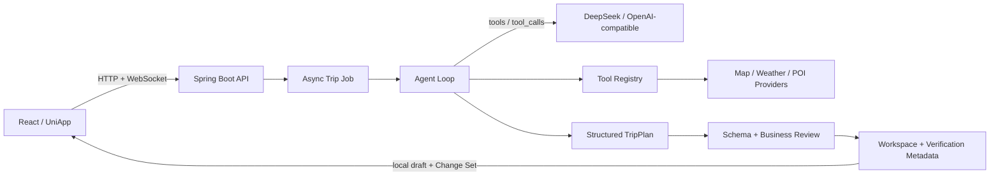

# HelloJourney V3 升级交付报告

> 交付日期：2026-08-20（Asia/Shanghai）
> 目标读者：项目维护者、前后端开发者、面试或开源评审者
> 当前分支：`test/hello-journey-v3-upgrade`
> 评审基线：`a479cba80b981450e1c1fe89e292baca0ca31b5d`
> 代码评审版本：`a75feecd1a8df97cec51f2c079d37f0ab3ef5f13`

本文记录本轮已经实现并验证的 V3 能力，也明确列出需要凭证、基础设施或后续产品迭代才能完成的事项。本文不把 Mock、Stub 或未来设计描述为真实生产能力。

## 1. 结论

HelloJourney 已从单次生成式的学生项目，升级为可验证、可编辑、可局部重新规划、可撤销的 AI Travel Workspace 基线。项目具备受限 Agent Tool Calling、Structured Output、Review Agent、异步任务、WebSocket 事件、Mock-first 前端和容器化部署链路。

本轮建议评分从 **56/100 提升到 85/100**。当前代码适合开源展示、面试演示和有凭证的 Staging 联调；由于仍缺少用户认证、多实例状态存储、真实 Provider 凭证 E2E 和生产观测平台，暂不建议直接开放为公网多用户服务。

## 2. 原始 56/100 的主要问题

基线证据记录在 [`docs/V3_BASELINE.md`](docs/V3_BASELINE.md)。原始审计文件 `HELLOJOURNEY_AUDIT.md` 不存在于当前工作树或可读取的审计分支 Git 对象，因此本轮重新执行了全部基线命令，没有伪造该文件。

原始问题集中在以下方面：

| 领域 | 原始问题 | 影响 |
|---|---|---|
| 安全 | 匿名 Settings API 可读写完整 Key、Cookie；错误可能回传上游信息 | Secret 泄漏与配置篡改 |
| 正确性 | Backend 117 tests / 1 failure / 3 errors；`@Async` self-invocation | 异步语义不可信，WebSocket 有竞态 |
| AI | `deepseek-chat` 旧模型；文本 `[TOOL_CALL]`；正则抓取 JSON | 不是真正 Agent，输出脆弱 |
| 前端 | Landing/Result 职责过重；无测试、undo/redo、局部修改预览 | 只能“生成后查看”，无法工作台式协作 |
| 可验证性 | AI 数据与地图/天气数据没有统一来源标识 | 用户无法判断数据可信度 |
| 工程化 | 无 lockfile、CI、Docker、生产环境说明 | 构建难复现，部署风险高 |
| 运行状态 | 任务仅在内存和本地文件；错误恢复弱 | 只适合单实例演示 |

## 3. 升级后的整体架构

主链路如下。蓝色语义对应产品入口，橙色语义对应外部 Provider，绿色语义对应校验与可执行结果。



关键不变量如下：

- 浏览器永远不接收服务器 Secret。
- 模型只能调用 Tool Registry 白名单中的工具，不能调用任意 Java 方法或系统命令。
- 模型修改行程时只生成通过校验的 Change Set；前端用户确认后才应用。
- `source`、`provider`、`verified_at` 和 `verification_status` 区分真实 Provider 数据与 AI 建议。
- WebSocket 失败后最多重连 2 次，随后降级到轮询；后端任务状态是进度的权威来源。

## 4. 已解决问题

### 4.1 安全边界

- `GET /api/settings` 只返回 Provider 是否已配置等非敏感状态。
- 生产环境默认关闭 Secret 更新；受控更新需要独立 Admin Token。
- `runtime_settings.json`、本地 `.env` 和任务数据目录不进入 Git。
- 错误响应和结构化日志不输出完整 Key、Cookie、Prompt 或模型私有 reasoning。
- WebSocket Origin 和 HTTP CORS 改为显式来源配置。
- 已用测试证明 Settings GET 不泄漏 Secret、匿名生产写入被拒绝、错误消息不包含完整 Key。

### 4.2 后端正确性

- 把旅行任务执行移到独立 `TripPlanningJobService`，消除 `@Async` self-invocation。
- 使用受 Spring 管理的有界线程池。
- 任务状态覆盖 processing、completed、failed、cancelled 和 timeout。
- 加入取消、幂等键、异常传播、任务文件持久化和 WebSocket 快照。
- 修复 WebSocket 测试竞态；最终 Backend 为 **152 tests / 0 failure / 0 error**。

### 4.3 DeepSeek 与 OpenAI-compatible Client

- 默认模型升级为 `deepseek-v4-pro`，Base URL 为 `https://api.deepseek.com`。
- 建立 request/response DTO，并建模 tool calls、usage、request ID、response ID 和 model metadata。
- 加入超时、有限重试、429/401/5xx 错误映射和安全结构化日志。
- Provider 配置统一使用环境变量；SiliconFlow 继续作为 OpenAI-compatible 可选路由。

### 4.4 Agent 与 Structured Output

- 新增 `ToolDefinition`、`ToolCall`、`ToolResult`、`ToolRegistry`、`ToolExecutor` 和 `AgentLoop`。
- 工具覆盖 `get_weather`、`search_poi`、`search_hotel`、`search_restaurant`、`geocode` 和 `route_plan`。
- Agent Loop 具备 8 次迭代上限、JSON Schema 参数校验、allowlist、超时、重试、重复调用保护、trace ID、取消和安全事件。
- TripPlan 通过 JSON Schema、Java DTO、Bean/手工校验和业务校验。
- Review Agent 校验日期、城市、坐标、时间冲突、预算复算、用户预算上限、酒店、路线提示、天气日期和虚假 verified 声明。
- 严重错误进入有限修复流程，不直接作为成功计划返回。

### 4.5 Travel Workspace

- Landing 支持单城市、多城市、日期、人数、预算、交通、住宿、兴趣和自然语言需求。
- Result 提供 Overview、Daily Itinerary、Budget、Weather、Knowledge Graph、AI Assistant 和 Agent Activity。
- 支持新增、编辑、删除和排序景点，调整时间和停留时长，跨天移动活动，修改酒店。
- Workspace 使用纯 reducer 管理 undo/redo，最多保留 50 个历史快照；草稿按 Plan ID 保存在浏览器 localStorage。
- Partial Replan API 只返回白名单 Change Set，前端展示 Before/After 后由用户 Apply 或 Reject。
- 新增版本化 JSON 导出和浏览器打印/PDF。
- MSW 与真实 API 共用 TypeScript contract；`VITE_USE_MOCK=true` 可独立演示主要流程。

### 4.6 工程化和部署

- 提交 `package-lock.json`，补充 typecheck、Vitest 和 Testing Library。
- 前端生产依赖审计为 0 个已知漏洞。
- 增加 GitHub Actions：Frontend lint/typecheck/test/build、Backend verify、UniApp build。
- 增加前后端多阶段 Dockerfile、Nginx API/WebSocket 反向代理、healthcheck 和 Compose 联调。
- 增加生产环境变量模板与 [`docs/DEPLOYMENT.md`](docs/DEPLOYMENT.md)。

## 5. 状态、持久化与恢复边界

| 状态层 | 所有者 | Key / 作用域 | 权威性 | 恢复与清理 |
|---|---|---|---|---|
| Workspace 当前行程 | React reducer | 当前页面 / Plan ID | 编辑会话权威状态 | undo/redo；重新加载时读取 localStorage |
| Workspace 草稿 | 浏览器 localStorage | `planId` | best-effort 草稿 | 用户浏览器范围；未实现 TTL 和跨设备同步 |
| 任务运行态 | Spring `TaskState` | task ID | 运行期间权威来源 | 成功、失败、取消、超时进入终态 |
| 任务文件 | 本地 JSON | task ID / 单实例 | 重启后的恢复来源 | 写入 `TRIP_TASK_DATA_DIR`；需运维清理策略 |
| WebSocket | 内存订阅者 | task ID / 连接 | 仅传输投影 | 断线重连 2 次，随后轮询 |
| Provider 响应 | Agent 当前调用 | trace/request ID | 外部事实输入 | 不持久化完整 Prompt 或 reasoning |

保证级别：

- **强保证**：Secret 不通过公共 Settings DTO 返回；Tool allowlist；Change Set 后端白名单校验；前端 Apply 前不改写行程。
- **最终一致**：WebSocket 断线后通过重连或轮询收敛到后端任务状态。
- **best-effort**：localStorage 草稿、单实例任务文件恢复、外部 Provider 重试。
- **不支持**：跨设备草稿、多实例任务竞争、用户级资源所有权和跨租户隔离。

## 6. 安全状态

当前状态比基线显著改善，但不等于已经达到公网多租户安全标准。

已验证：

- 当前代码和示例文件没有提交真实 API Key、Cookie、Token 或密码。
- 普通前端无法读取 Secret；生产匿名用户无法写 Secret。
- 外部错误映射为稳定、安全的客户端错误。
- Nginx 增加 CSP、frame、MIME、Referrer 和 Permissions Policy 响应头。

仍需人工处理：

- Git 历史扫描发现过一个疑似真实 OpenAI-style Secret。报告未输出其值或指纹。仓库所有者必须在对应 Provider 控制台 revoke/rotate；改当前代码不能替代轮换。
- 对公网发布前必须增加用户认证、Plan 所有权校验、API 限流、WAF 和审计日志。
- Admin Token 是没有完整身份系统时的过渡控制，不是长期 IAM 方案。

## 7. DeepSeek V4 Pro 状态

状态为：**integration ready, credential required**。

以下内容已通过 Stub/Mock 测试：基础 Chat Completion、Tool Calls、usage、request ID、429 重试、401 非重试、错误脱敏和 Structured Output。没有真实 `LLM_DEEPSEEK_API_KEY`，因此本报告不声称 DeepSeek 真实请求成功，也不声称真实 token 计费已经核对。

SiliconFlow 可通过 OpenAI-compatible Provider 配置接入，但同样需要真实 Key 与模型可用性验证。

## 8. Agent Tool Calling 状态

Agent Tool Calling 已进入真实结构化协议，不再依赖 `[TOOL_CALL:xxx]` 文本。旧文本路径只作为历史兼容线索，不是 V3 主链路。

测试覆盖：

- 多轮 LLM → tool_calls → tool results → LLM。
- JSON 字段顺序不同的重复调用去重。
- 工具参数 schema、未知工具、超时、重试和失败结果。
- max iterations、取消和安全 Agent Event。
- Structured Output 修复与 Review Agent 阻断。

真实地图 Tool 的准确率仍取决于腾讯地图或 Google Maps 凭证、配额和上游数据质量。

## 9. Frontend Workspace 状态

Workspace 已覆盖本轮差异化目标：editable、undoable、partial replan、verified data、AI change preview、safe agent observability 和 graceful failure recovery。

实际浏览器验证覆盖：

- Mock 生成到 Result 主流程。
- 景点新增和 undo。
- AI Partial Replan 预览和 reject。
- verification badge。
- 390×844 移动端布局，无水平溢出。
- 控制台中的 MSW/Ant Design 弃用警告已清理。

仍未达到完整产品形态的部分：

- 当前“地图能力”以 Provider Tool、坐标、路线数据和 Knowledge Graph 为主，还没有成熟的可拖拽交互地图画布。
- 打印/PDF 是浏览器打印能力，不是后端生成的品牌化 PDF。
- localStorage 草稿没有版本迁移、TTL、跨设备同步和命名版本列表。
- Landing 和 Result 的 CSS 仍偏大，需要继续拆成设计 token、布局和 feature 样式。

## 10. 测试与构建结果

最终证据如下：

| 范围 | 命令/验证 | 结果 |
|---|---|---|
| Frontend | `npm run typecheck` | PASS |
| Frontend | `npm run lint` | PASS，0 error |
| Frontend | `npm run test -- --run` | PASS，3 files / 6 tests |
| Frontend | `npm run build` | PASS，3981 modules |
| Frontend | `npm audit --omit=dev` | PASS，0 vulnerabilities |
| Backend | `mvn test` | PASS，152 tests / 0 failure / 0 error |
| Backend | `mvn package` | PASS |
| UniApp | `npm run build:mp-weixin` | PASS；仅有 Sass legacy API 警告 |
| Docker | `docker compose config --quiet` | PASS |
| Docker | Frontend + Backend image build | PASS |
| Runtime | `/health`、Swagger、Nginx `/healthz`、反向代理 `/api/trip/health` | PASS / HTTP 200 |
| Runtime | Trip submit + WebSocket | PASS；收到 `attraction_search` 10% 事件 |
| Runtime | 无 Key 的最终状态 | 按预期 failed，只返回“旅行规划失败，请稍后重试” |

前端生产构建已按路由和重组件拆包。最大懒加载 KnowledgeGraph chunk 约 532kB；后续可以继续按 ECharts 子模块优化，但不阻塞当前交付。

## 11. Deployment readiness

当前达到单实例 deployment-ready：

- Docker 镜像使用多阶段构建；Backend 运行时使用非 root 用户。
- Nginx 同源代理 HTTP API 和 WebSocket，并提供 SPA fallback。
- Compose 为前后端配置 healthcheck 和启动依赖。
- Prod Profile 支持显式 CORS、优雅关闭、压缩和 Actuator。
- CI 使用 lockfile 和固定 Java/Node 主版本运行质量门禁。
- 部署、监控、Staging、回滚和 Secret 管理步骤已文档化。

对公网生产仍缺少 PostgreSQL/Redis、共享任务队列、认证授权、限流、集中日志/指标、备份和灾难恢复。这些属于下一阶段，不应隐藏在“Docker 能启动”的结论中。

## 12. 未解决问题与风险

| 风险或边界 | 触发条件 | 影响 | 当前保护 | 下一步 |
|---|---|---|---|---|
| 历史疑似 Secret | 历史 Key 仍有效 | Provider 被滥用 | 当前代码已移除 | 立即 revoke/rotate |
| 无真实 Provider E2E | 未配置 Key | 无法证明真实 AI/地图成功率 | Stub/Mock 契约测试、安全失败 | Staging 小额度验证 |
| 单实例任务状态 | 部署多个 Backend | 重复任务、状态不一致 | 本地文件恢复 | PostgreSQL/Redis + 队列 |
| 无用户认证 | 公网开放 | 越权访问计划、滥用成本 | Settings 写入默认关闭 | OIDC/JWT + resource ownership |
| 无 API rate limit | 恶意或意外高流量 | Provider 成本与线程池耗尽 | 有界线程池、超时 | Gateway 限流和配额 |
| 外部数据不稳定 | Provider 限流或 XHS 变化 | 数据缺失、needs verification | Adapter 降级、verification metadata | Provider SLO 和监控 |
| UniApp 不完全同构 | Web 持续演进 | 移动端功能落后 | 共用部分 API 类型 | 建立 contract 测试和功能矩阵 |
| 大样式文件 | 继续叠加页面样式 | 维护和回归成本增加 | feature 组件已拆分 | 拆设计 token 和 feature CSS |

## 13. 用户下一步需要手工完成的事情

按优先级执行：

1. 在 Provider 控制台撤销并轮换历史疑似 Secret。
2. 在仓库外或 Secret Manager 中创建 Staging 环境变量，禁止把填充值提交到 Git。
3. 使用有预算上限的 DeepSeek 和地图测试 Key，在 Staging 验证一条真实单城市和一条多城市行程。
4. 核对真实 Tool Call、token 用量、429 重试、路线/天气来源标签和 Review 结果。
5. 接入认证、资源所有权和网关限流后，再考虑公网开放。
6. 为任务存储选择 PostgreSQL/Redis/队列方案，再部署多个 Backend 副本。
7. 由项目负责人审查本分支；确认后通过普通 PR 合并。不要 force push，也不要直接在 main 修改。

## 14. 需要的 API Key 列表

只配置实际启用的 Provider：

| 变量 | 用途 | 必需性 |
|---|---|---|
| `LLM_DEEPSEEK_API_KEY` | DeepSeek V4 Pro | 默认 Provider 必需 |
| `LLM_SILICONFLOW_API_KEY` | SiliconFlow OpenAI-compatible 路由 | 可选 |
| `TENCENT_MAPS_KEY` | 国内 POI、地理编码、天气、路线 | 建议至少配置一个地图 Provider |
| `GOOGLE_MAPS_API_KEY` | Google Maps 备用路线 | 可选 |
| `XHS_COOKIE` / `XHS_XS` / `XHS_XS_COMMON` / `XHS_XT` | 小红书可选 Adapter | 可选且不作为 SLA 依赖 |
| `SETTINGS_ADMIN_TOKEN` | 受控环境临时管理 Settings | 生产默认不启用写入 |

所有值必须为空占位或由 Secret Manager 注入。任何浏览器可见的 `VITE_*` 变量都不能存放上述 Secret。

## 15. 提交记录、分支与状态

本轮实现提交如下：

```text
3cceaa5 docs: capture v3 upgrade baseline
cde8888 fix(security): protect runtime secrets and settings APIs
b6bed9e fix(backend): stabilize async trip execution
1ecff5c feat(ai): add DeepSeek V4 Pro provider support
0534d4c feat(agent): implement native tool calling loop
2d35ddb feat(agent): add structured planning and review
29ffe9a refactor(frontend): establish travel workspace architecture
ce38b0c feat(frontend): add editable itinerary workspace
9c28bc3 feat(agent): propose validated partial replan changes
18fa6d1 fix(backend): include travel days in trip history
e90446f feat(frontend): add agent activity and partial replan UX
87d7969 feat(workspace): complete trip constraints and export
423ff0a chore(deploy): add production deployment baseline
c6803f7 chore(deploy): ignore local task persistence
a75feec fix(agent): enforce requested budget limit
```

交付约束：

- 当前分支：`test/hello-journey-v3-upgrade`。
- 最终 Git status：干净。
- `frontend/public/mockServiceWorker.js` 的 Git blob hash 始终与基线一致：`33dde9e770037fa36bc68b78418875a5379f25cc`。
- 本轮没有 merge main、rebase main、force push、删除用户分支或提交真实 Secret。

## 16. 验收证据矩阵

| 关键不变量 | 实现证据 | 测试/运行证据 | 保证 | 结论 |
|---|---|---|---|---|
| Settings 不泄漏 Secret | 安全 DTO、生产写开关、Admin Token | Controller/Manager tests | 强 | 已完成 |
| 任务真正异步 | 独立 Job Service + 有界 Executor | Async、Controller、WebSocket tests | 强（单实例） | 已完成 |
| 模型只能调用白名单工具 | Registry + schema validator + executor | AgentLoop/ToolExecutor tests | 强 | 已完成 |
| Structured TripPlan 可阻断严重错误 | JSON Schema + DTO + Review Agent | Planning/Review tests | 强 | 已完成 |
| AI 不直接覆盖用户行程 | Change Set preview/apply/reject | reducer/UI tests + 浏览器验证 | 强（当前标签页） | 已完成 |
| 断线后进度可收敛 | WS 重连两次后轮询 | API tests + Runtime WS | 最终一致 | 已完成 |
| 真实 DeepSeek 成功 | Client 已就绪 | 只有 Stub/Mock | 未验证 | 需要凭证 |
| 多实例状态一致 | 无共享状态库 | 无 | 不支持 | 后续建设 |

## 17. 重新评分

| 维度 | 分数 | 依据 |
|---|---:|---|
| Architecture | 88 | Agent、Provider、Tool、Review、Workspace 边界清晰；单实例状态仍受限 |
| Frontend | 87 | 可编辑、撤销、局部重规划、验证标签、响应式与 Mock-first 已完成 |
| Backend | 86 | 152 tests 全绿、异步任务稳定；仍缺数据库、Redis 和身份系统 |
| Agent | 89 | 原生 Tool Calling、Structured Output、Review 和安全事件已完成 |
| Security | 82 | Secret 边界已修复；历史轮换、认证、所有权和限流待完成 |
| Testing | 86 | 前后端测试与运行时冒烟覆盖主链路；真实 Provider E2E 待完成 |
| UX | 86 | Workspace 核心差异化成立；成熟交互地图和版本列表待完成 |
| Deployment | 80 | Docker、Nginx、Compose、CI、健康检查齐全；生产观测和 HA 待建设 |
| **Overall** | **85** | 可维护、可演示、可继续演进，但还不是公网多租户生产完成态 |

## 18. 评审建议

评审者应重点检查三条链路：Secret 是否可能经任何 DTO 或日志返回；Change Set 是否能绕过后端白名单修改可信字段；任务状态在失败、取消、重连和重启时是否保持单实例一致。真实 Provider 验证必须在受控 Staging 完成，不能用 Mock 结果替代上线判断。
